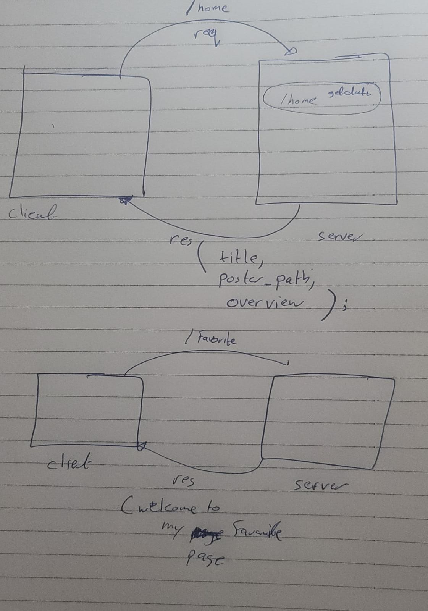
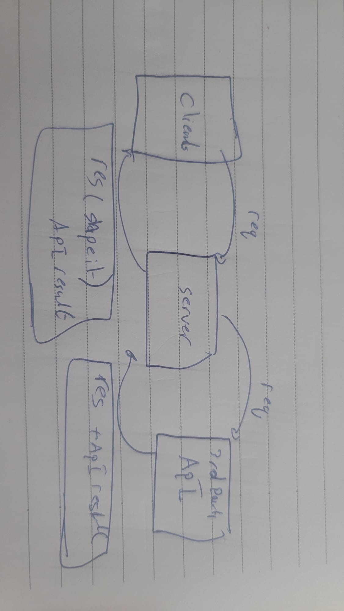

# Project Name -  Movies-Library

**Author Name**: Muhammad AL-SAD

## WRRC

## Overview

## Getting Started
- Initialize : npm init -y --> (and the y for default value)
* Install Packages : npm install express 
* Open vs code and run server.js file on terminal
-----------------------
## Run the Server:
* Node (filename).js
--------------------

## Project Features
Its show me Information details of any new movies

-------------------------------------------------------------

## -v1.1 UPDATES

---------------------------

## Api img 

--------------------------

OPEN THE TERMENIAL 

* npm install nodemon
* npm i dotenv
* npm i axions
* npm i cors

## project change 
-------------------------

Added new features to get the data from API and load it 

send a query to search and get a result as info 
